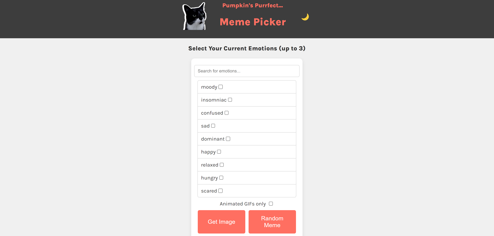

# Pumpkin's Purrfect Meme Picker

Welcome to **Pumpkin's Purrfect Meme Picker**, a simple web app where you can select your emotions and get matching memes or GIFs! Pumpkin the cat is here to help you express your current mood with a perfect meme or a random surprise.

## Table of Contents

- [Pumpkin's Purrfect Meme Picker](#pumpkins-purrfect-meme-picker)
  - [Table of Contents](#table-of-contents)
  - [Demo](#demo)
  - [Features](#features)
  - [Technologies](#technologies)
  - [Installation](#installation)
  - [Usage](#usage)
  - [Screenshots](#screenshots)
  - [License](#license)

## Demo

Check out the live demo of Pumpkin's Purrfect Meme Picker [here](https://pumpkins-purrfect.dhiashalabi.live/).

## Features

- Search for emotions and get a meme that matches your current mood.
- Limit your results to animated GIFs.
- Choose up to 3 emotions at a time.
- Toggle between light and dark theme with the 🌙 button.
- Get a random meme or pick based on emotions.
- Simple and fun UI with Pumpkin the cat as your mascot!

## Technologies

- **HTML** for the structure.
- **CSS** for styling.
- **JavaScript** for functionality.
- **Google Fonts** (Karla) for custom typography.

## Installation

To run this project locally, follow these steps:

1. Clone the repository:

   ```bash
   git clone https://github.com/your-username/pumpkin-meme-picker.git
   ```

2. Navigate to the project directory:

   ```bash
   cd pumpkin-meme-picker
   ```

3. Open the `index.html` file in your browser:
   ```bash
   open index.html
   ```

Or you can run a local server using tools like [Vite](https://vitejs.dev/), [live-server](https://www.npmjs.com/package/live-server), or any other.

## Usage

1. Open the app in your browser.
2. Enter emotions in the search bar or select from the emotion list.
3. Click the **Get Image** button to see a matching meme.
4. Use the **Random Meme** button for a random surprise.
5. Toggle the theme with the 🌙 button to switch between dark and light mode.

## Screenshots


Screenshot of the app's header with Pumpkin the cat and meme controls.

## License

This project is open source and available under the [MIT License](LICENSE).

---

Enjoy using Pumpkin's Purrfect Meme Picker! 😺✨
